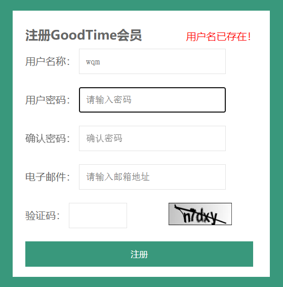
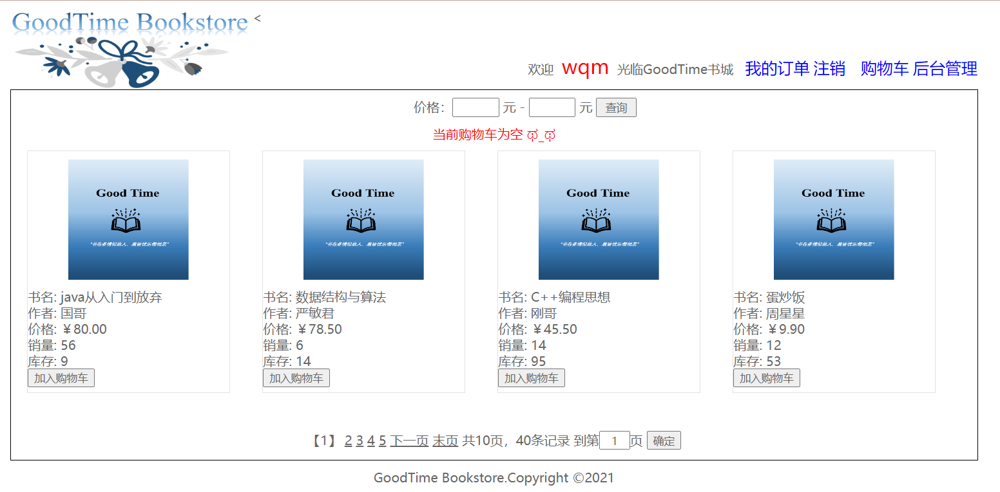
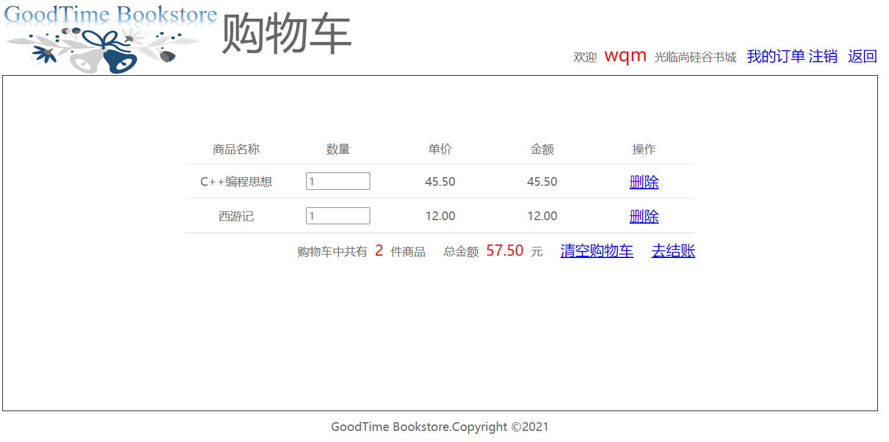
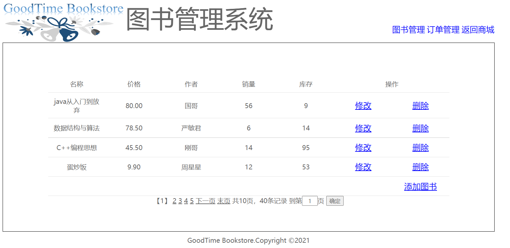

# Java Web:书城项目
基于JavaWeb的书城项目，线上书籍选购平台
#### 核心技术点：
Servlet程序、Filter过滤器、Listener监听器、jsp页面、EL表达式、JSTL标签库、jQuery框架、Cookie技术、Session会话、JSON使用、Ajax请求 

(注重功能实现，不关注前端，页面并不美观)

#### 功能：

1. 用户注册
    1. 用户名是否可用（数据库中是否已经存在）检查 
 
    2. 用户名、密码、邮箱等是否符合要求
    3. 验证码
2. 用户登录

3. 首页
    1. 书籍展示，分页处理
    2. 选择书籍加入购物车
    3. 对书籍按价格进行筛选
    4. 展示当前购物车商品数量以及最后加入购物车的商品名称
 
4. 用户购物车
    1. 删除购物车内商品
    2. 修改选购的商品数量
    3. 进行结算
    4. 清空购物车
    
5. 后台管理
    1. 修改商品信息
    2. 添加商品
    
